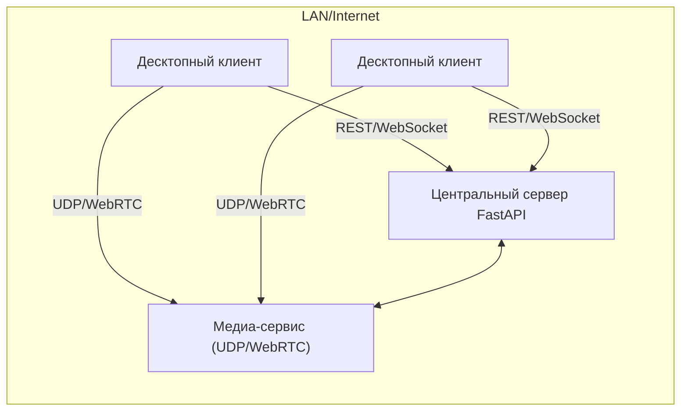
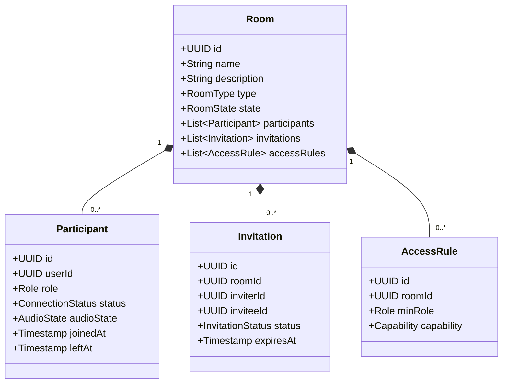
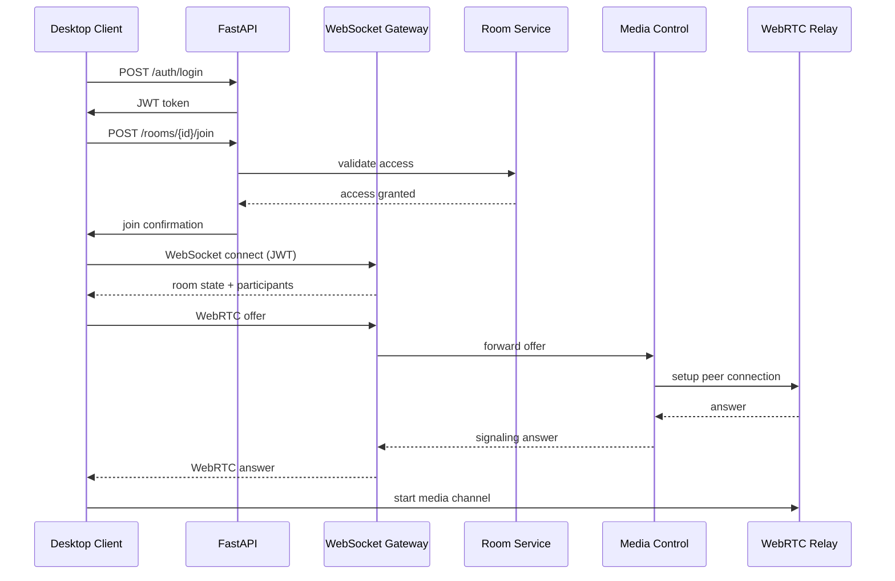
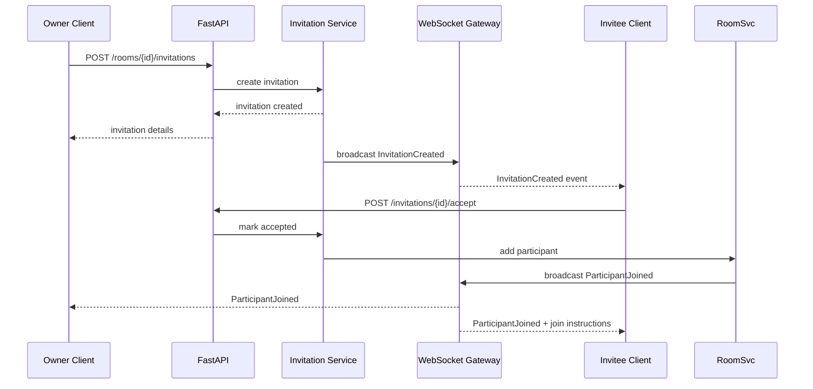

# Архитектура VolVoice

## Сетевые топологии и протоколы

### Обзор
VolVoice опирается на центральный сервер приложений, реализованный на FastAPI. Сервер предоставляет REST API для конфигурации и WebSocket-интерфейс для событий в реальном времени. Для передачи медиа используется выделенный UDP-транспорт.




**Обоснование:**

* Единая точка управления пользователями и комнатами.
* Управление подключениями и маршрутизация через центральный сервер упрощают контроль доступа и мониторинг.
* UDP-транспорт позволяет обеспечить низкую задержку аудио.

### Сервер FastAPI + WebSocket/UDP

* **REST API**: регистрация, аутентификация, управление комнатами, приглашениями и правами.
* **WebSocket**: события о статусах, присоединении/отключении, сигнальные сообщения WebRTC.
* **UDP транспорт**: медиапотоки через WebRTC или кастомный протокол.

Сервер масштабируется горизонтально через ASGI workers; для UDP/WebRTC используется отдельный сервис, который можно вынести в отдельный контейнер.

## Модель домена



### Сущности и статусы

* **RoomState**: `ACTIVE`, `SCHEDULED`, `CLOSED`.
* **ParticipantRole**: `OWNER`, `MODERATOR`, `SPEAKER`, `LISTENER`.
* **ConnectionStatus**: `OFFLINE`, `CONNECTING`, `CONNECTED`, `DISCONNECTED`.
* **AudioState**: `MUTED`, `UNMUTED`, `TALKING`.
* **InvitationStatus**: `PENDING`, `ACCEPTED`, `DECLINED`, `EXPIRED`.
* **Capability** (для AccessRule): `MANAGE_ROOM`, `INVITE`, `KICK`, `MUTE_OTHERS`, `SHARE_SCREEN`.

**Правила доступа:**

* `OWNER` и `MODERATOR` могут управлять комнатой и приглашениями.
* `SPEAKER` может включать микрофон и приглашать слушателей к выступлению.
* `LISTENER` может слушать, запросить выступление.
* `AccessRule` расширяет базовые права через Capability.

## Приглашения и потоки статусов

* Приглашения создаются `OWNER` или `MODERATOR`. Сервер отправляет `InvitationCreated` по WebSocket.
* При принятии отправляется `ParticipantJoined`, статус пользователя обновляется.
* Отказ или истечение генерируют `InvitationClosed` и обновляют состояние.

## Передача аудио

### Вариант 1: WebRTC через aiortc

**Плюсы:**

* Использование стандартизованного протокола.
* Сквозная поддержка NAT traversal (STUN/TURN).
* Адаптивный битрейт, встроенная обработка потерь.

**Минусы:**

* Усложнённая инфраструктура (нужны STUN/TURN).
* Большая зависимость от сторонних реализаций.

**Рекомендация:** Использовать WebRTC как основной канал, благодаря зрелому стэку и совместимости с браузерами.

### Вариант 2: Кастомный протокол на opuslib/pyAV

**Плюсы:**

* Полный контроль над форматами и оптимизациями.
* Простая интеграция с нативными клиентами.

**Минусы:**

* Необходимость реализовать управление сессией, повторную передачу пакетов, jitter buffer.
* Дополнительная работа по адаптивному битрейту и защите от потерь.

**Вывод:** оставить кастомный протокол как резервный для специализированных сценариев (например, внутренние сети без WebRTC). Инкапсулировать через абстракцию `MediaTransport`, позволяющую переключаться между реализациями.

## Компонентная диаграмма

```mermaid
flowchart TD
    subgraph Server
        API[REST API (FastAPI)]
        WS[WebSocket Gateway]
        Auth[Auth Service]
        RoomSvc[Room Service]
        InvitationSvc[Invitation Service]
        AccessSvc[Access Control]
        MediaCtrl[Media Control Service]
        DB[(PostgreSQL)]
        Cache[(Redis)]
    end

    subgraph MediaLayer
        WebRTCRelay[WebRTC Gateway]
        CustomRelay[Custom UDP Relay]
    end

    subgraph DesktopClient
        UI[UI Layer]
        StateStore[State Store]
        Signaling[Signaling Client]
        MediaClient[Media Transport Client]
    end

    API --> Auth
    API --> RoomSvc
    API --> InvitationSvc
    API --> AccessSvc
    RoomSvc --> DB
    InvitationSvc --> DB
    AccessSvc --> DB
    WS --> Signaling
    MediaCtrl --> WebRTCRelay
    MediaCtrl --> CustomRelay
    WebRTCRelay --> MediaClient
    CustomRelay --> MediaClient
    UI --> StateStore
    StateStore --> Signaling
    Signaling --> MediaClient
    Auth --> Cache
```

## Диаграмма последовательности: подключение к комнате



## Диаграмма последовательности: приглашение участника



## Точки расширения

* **MediaTransport**: интерфейс для подключения новых транспортов (например, интеграция с SIP).
* **AccessRuleProvider**: возможность подключать внешние системы авторизации (LDAP, RBAC сервисы).
* **EventBus**: интеграция с внешними аналитическими или мониторинговыми системами через Kafka/Webhooks.
* **RecordingService**: модуль записи и хранения сессий, подключаемый к WebRTC Relay.
* **Bot API**: расширение WS для интеграции голосовых ботов.

## Нефункциональные требования

* Масштабируемость: отдельные сервисы можно контейнеризировать и масштабировать независимо.
* Низкая задержка: использование UDP и WebRTC, локальный кэш для частых запросов.
* Безопасность: JWT + TLS, SRTP для медиа, контроль доступа на уровне ролей.

## Следующие шаги

1. Реализация прототипа FastAPI сервера с REST и WebSocket.
2. Интеграция aiortc для WebRTC сигнального канала.
3. Разработка десктопного клиента (Qt/PySide или Electron) с поддержкой WebRTC.
4. Набор интеграционных тестов для проверки сценариев подключения и приглашений.
